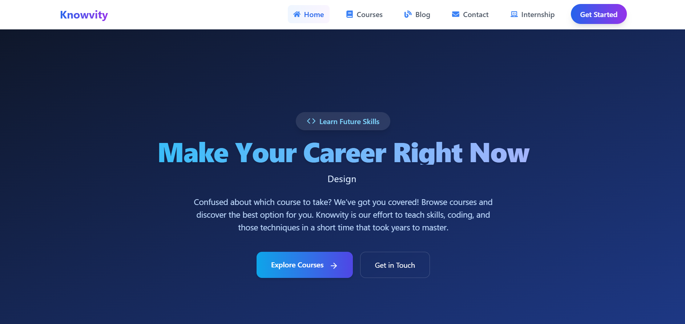
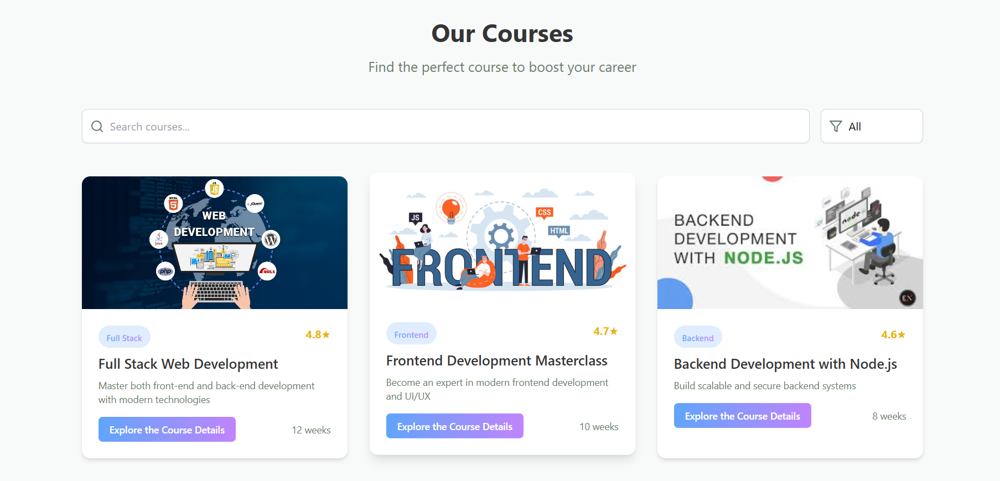
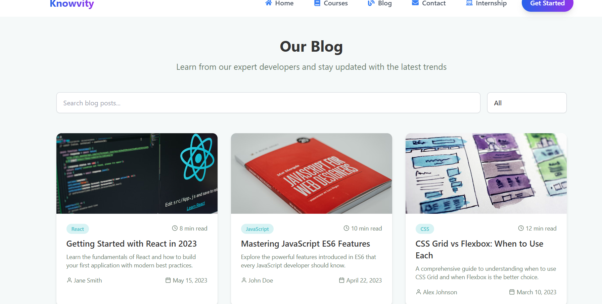

# Knowvity - Learn Future Skills, Build Your Career



---

## About the Project

**Knowvity** is an educational platform designed to help learners quickly master modern skills like coding, digital marketing, and career-building techniques. Through project-based learning and expert mentorship, we aim to accelerate your career growth in tech and beyond.

Our courses cover full-stack development, frontend and backend technologies, and practical real-world applications.

---

## Features

 

- 🎓 Comprehensive courses on **Full Stack Web Development**, **Frontend Development**, and **Backend Development with Node.js**  
- 🛠️ Project-based hands-on learning approach  
- 👩‍🏫 Career support and mentorship programs  
- 🌐 Alumni working at top companies like **Amazon**, **Google**, **Microsoft**, and more  
- 📰 Expert-written blog covering the latest tech trends

---

## Getting Started

To run this project locally using [Bun](https://bun.sh):

### 1. Clone the Repository

```bash
git clone https://github.com/komalkumarpalwai/Knowvity.com.git
cd Knowvity.com
2. Install Dependencies
bun install

3. Run the Development Server
bun run dev


The app will be running at:
👉 http://localhost:3000 (or whichever port is configured)

4. Build the Project (for production)
bun run build

5. Preview the Production Build
bun run preview

Live Demo

🚀 See the live website here: https://knowvity.com
